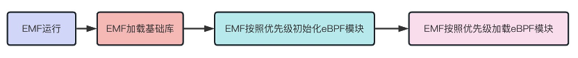
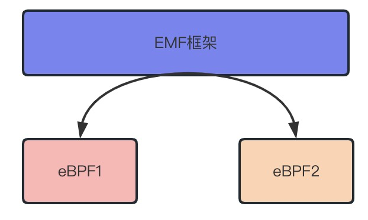

# EMF(ebpf-module-framework)
eBPF（extended Berkeley Packet Filter）是一种在 Linux 内核中运行的虚拟机技术，它可以在内核中执行安全的、高效的、可编程的网络和系统监控任务。eBPF 最初是为网络流量过滤和分析而设计的，但现在已经扩展到了其他领域，如安全、性能分析、容器和云计算等。eBPF 的出现使得 Linux 内核具备了更强大的可编程性和灵活性，为系统监控和网络安全提供了更多的可能性。同时，eBPF 还具有高效、安全、可扩展等优点，成为了 Linux 内核中不可或缺的一部分。

本章主要引入模块EMF(ebpf-module-framework)，该模块主要提供一种eBPF编程框架，用于研发或测试人员快速编写eBPF程序，从而完成功能研发，性能分析或故障检测的功能。

## EMF总体介绍
EMF(ebpf-module-framework)是一个基eBPF的应用程序框架，主要用于提供一种规则，方便开发者可以更轻松的增加一个eBPF程序。
在EMF当中， 所有eBPF程序都应被当成一个模块，类似于c语言的动态库，模块可以为静态的，也可以为动态的。EMF需要提供一些基础模块，用于完成一些特定事件。用户在使用EMF工程时，可以使用现有的模块，也可以增加新模块，从而完成指定功能。


如上图，eBPF程序的加载和卸载都应该交由EMF框架来完成，eBPF程序只需要按照EMF指定的框架模版填入对应代码即可。这样EMF程序加载的时候，就可以完成对应的初始化动作。

 

同样在EMF的库中，应当提供对应的通信API，这些API和dbus/ubus雷同，可以实现一些eBPF模块之间的特定通信，比如eBPF需要使用的尾指针调用（设计期望，所有eBPF都可以实现尾指针调用，这样就可以完成不同hook点之间的协同工作）。



在这里EMF同时也扮演一个bus的作用。

注：静态方式比如简单做成类似于C语言的.a即可。动态方式也可以在EMF当中使用dlopen之类的函数去读取动态eBPF模块当中对应的符号表（比如struct module符号，该符号位全局符号）。

## 构建

**依赖:**
- libelf
- zlib

```
$ git clone https://github.com/OpenCloudOS/EMF-ebpf-module-framework.git
```
**Ubuntu:**

下载依赖包
```
$ sudo apt-get install -y  make clang zlib1g-dev llvm libelf-dev libbpf-dev libbpfcc-dev linux-tools-$(uname -r) linux-headers-$(uname -r)
```
编译
```
$ make -j$(nproc)
```

## EMF模块介绍
EMF支持两种加载模式：一、EMF模块静态链接；二、EMF模块动态加载。通常，在入口函数main启动后(core/emf.c)，EMF框架会去主动查找静态模块，分别去执行静态模块的初始化函数和加载函数；然后EMF才会去读取动态模块，并处理动态模块的初始化和加载函数。所以这里有一个优先级的关系，即静态模块的优先级永远高于动态模块的优先级。

一、静态链接
```
EMF框架支持在代码中以静态模块的方式进行编写，具体语法如下：
struct module example_ebpf = { 定义一个eBPF的静态模块
	.prio = 1,                   定义该eBPF模块的加载优先级
	.name = "example",           定义该eBPF模块的名字
	.create = example_create,    定义该eBPF模块的初始化函数
	.attach = example_attach,    定义该eBPF模块的加载函数
	.destroy = example_destroy,  定义该eBPF模块的卸载函数
};
 
ebpf_module(example_ebpf);     将该eBPF模块插入到EMF框架

ebpf_module函数支持将eBPF静态模块连接到EMF框架当中。开发者只需要按照这种格式将eBPF模块写出来，然后将文件扔到modules目录下即可。在编译阶段，编译框架会将这个模块自动静态链接到EMF的对应位置。

详细请参考modules/example.c代码。
```
二、动态链接
```
EMF框架支持在代码中以动态模块的方式进行编写，原理同C语言加载so库文件，具体语法如下：
struct module example_ebpf = { 定义一个eBPF的静态模块
	.prio = 1,                   定义该eBPF模块的加载优先级
	.name = "example",           定义该eBPF模块的名字
	.create = example_create,    定义该eBPF模块的初始化函数
	.attach = example_attach,    定义该eBPF模块的加载函数
	.destroy = example_destroy,  定义该eBPF模块的卸载函数
};
 
ebpf_module(example_ebpf);     将该eBPF模块插入到EMF框架

ebpf_module函数同样也支持eBPF动态模块。开发者只需要按照这种格式将eBPF模块写出来，然后将对应的源文件扔到dynamic目录下即可。在编译阶段，编译框架会将这个模块自动编译成EMF框架支持的动态eBPF模块的格式。

详细请参考modules/example.c代码。
```

三、EMF功能说明
```
1，支持EMF静态和动态模块的加载/卸载；
2，支持EMF的初始化和加载/卸载eBPF模块；
3，支持EMF的通信总线ebus；
4，支持eBPF模块之间尾指针调用API;
5，支持服务注册，远程调用，订阅，监听事件，信号发送等功能；
6，可扩展性强；
```

四、EMF框架API说明
```
待续
```
